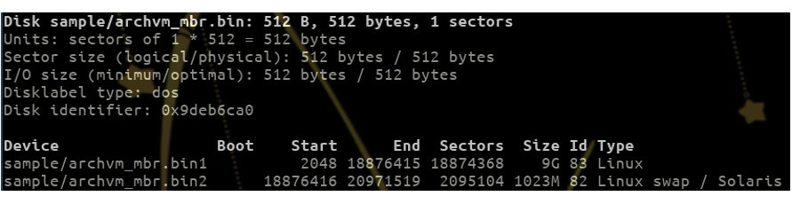
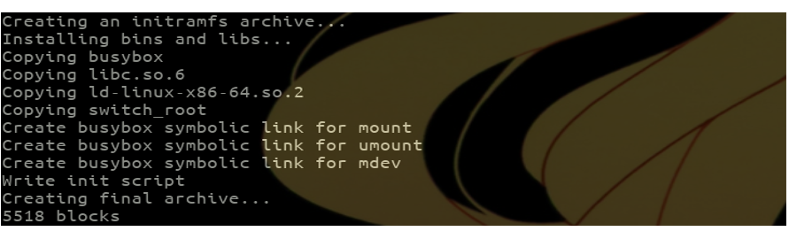
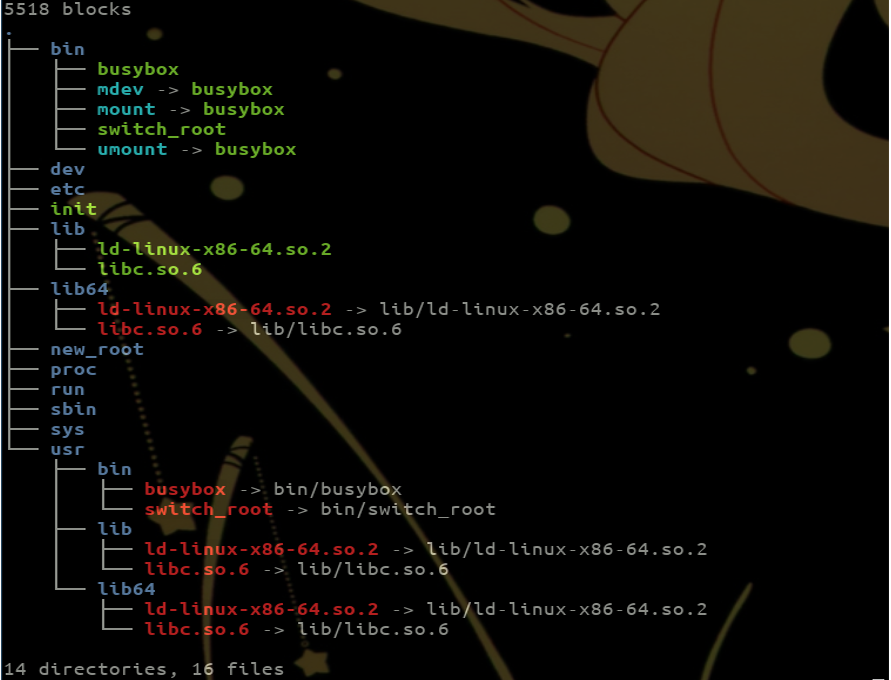

# CForFun
This GitHub aims to be a testing platform for Linux Kernel development and study. It compiles several project to explore specific aspects of the low-level system through simplified re-implementation of specific features or through various module development.

## Project #1 : Simple Master Boot Record (MBR) Analyser
Corresponding to the first 512 bytes of a storing device (e.g HDD and such), the Master Boot Record (MBR) is the place loaded by the BIOS at the booting phase. It is segmented as the following :
- The Boot loader (for example GRUB), an executable code in charge of loading the kernel
- The partition table describing the 4 partitions of the device
- The magic number to validate the MBR

This project takes a storing device file as argument (typically /dev/sda or VM image files), read the first 512 bytes and tries to analyse the partition table. One usage example is shown below :
```
./bin/partition_record_reader sample/archvm.bin
```


This program aimed to provide a simplified but still equivalent output as the *fdisk* command :
```
fdisk -l sample/archvm.bin
```


Documentation :
- [Walkthrough MBR analyze with bash commands](http://k5rec.blogspot.com/2006/11/linux-analyzing-master-boot-record-and.html)
- [Well explained LInux booting process](https://www.crybit.com/linux-boot-process/)
- [Master boot record wikipedia page](https://en.wikipedia.org/wiki/Master_boot_record)

## Project #2 : Simple Initramfs Tools
At the boot stage, the initramfs (Initial RAM Filesystem) is an intermediary and optional step between the bootloader (e.g grub and such) and the actual kernel. If the hardware and root device configuration is well-known the kernel can initialize itself and mount the root partition alone using built-in drivers, but in certain cases an initramfs is necessary. In it most simplistic form the initramfs provides an early userspace to mount the different devices (especially the root partition) and start the kernel, but its behavior can be extended to specific usages such as :
- Mounting an encrypted or logical root partition
- Providing rescue shell if something goes wrong
- Loads specific modules necessary to boot
- etc

This project consists of a bash script that allows to both list the content of an initramfs archive and also create a basic initramfs booting on the /dev/sda1 root partition. Those 2 usages are shown below :
```
./initramfs_basictools create
````


This command creates an initramfs archive that boots on the /dev/sda1 root partition.

```
./initramfs_basictools list initramfs-linux.img
```


This command list the content of an initramfs archive, it is a simplified version of the *lsinitramfs* command (in a way it only supports gzip formatted archive) :
```
lsinitramfs initramfs-linux.img
```


Documentation :
- [Initramfs history and detailed documentation](https://www.kernel.org/doc/Documentation/filesystems/ramfs-rootfs-initramfs.txt)
- [Tutorial to make a custom initramfs](https://wiki.gentoo.org/wiki/Custom_Initramfs)
